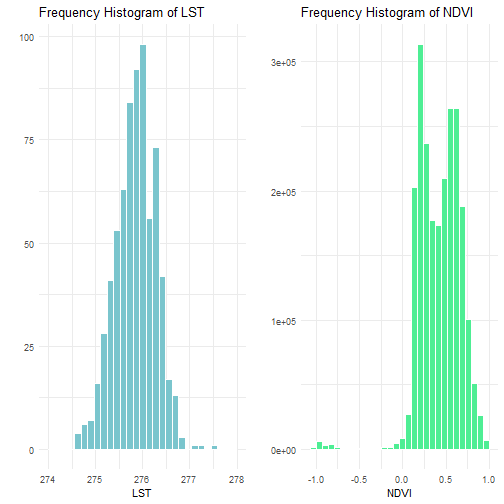
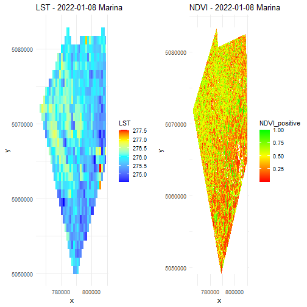
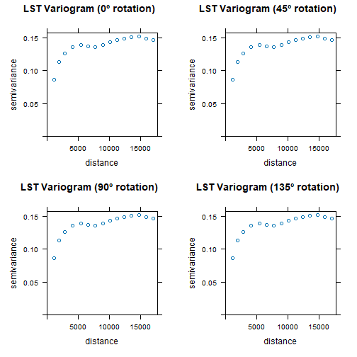
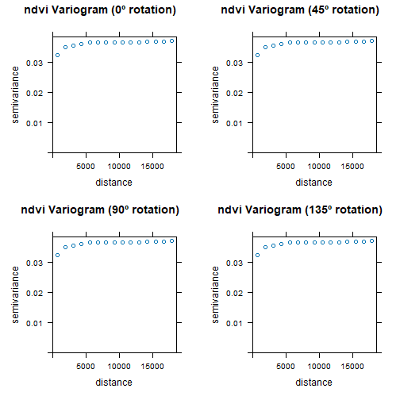
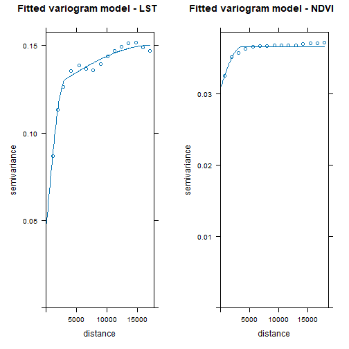
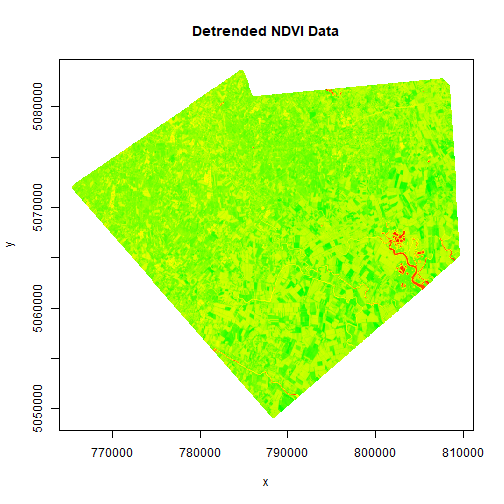
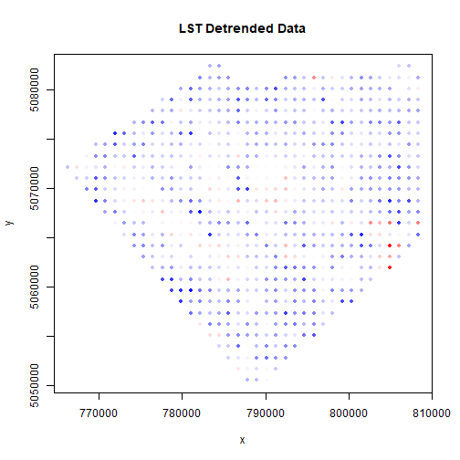
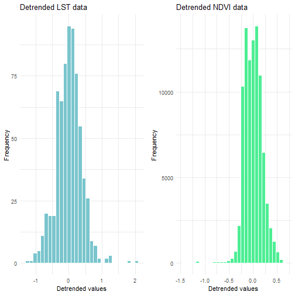
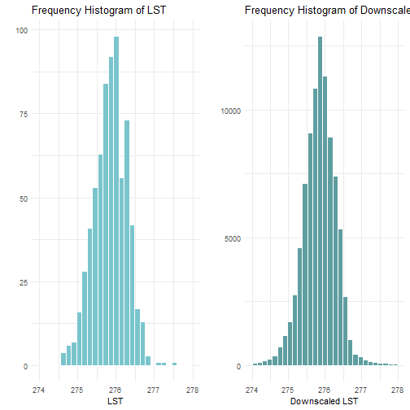
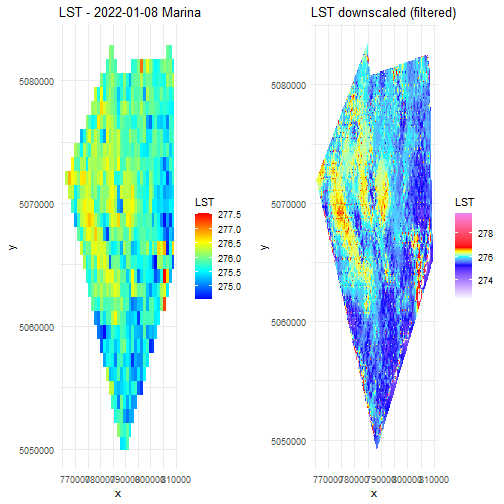

```r
library(gridExtra)
library(raster)
library(terra)
library(ggplot2)
library(sp)
library(gstat)
library(atakrig) # using atakrig for every operation except for the modelling part
library(parallel)
library(lattice)
library(devtools)
library(scales)
```

```r
# Importing the data ------------------------------------------------------

# setwd("~/albergo_progettoGIS/albergo_Input_data+metadata") # <- insert data folder path here
# setwd('C:/Users/EdoardoAlbergo/Desktop/master/Project Work/stg_data')

ndvi_raster_path <- "NDVI_20220108_marina.tif"
lst_raster_path <- "LST_20220108_marina.tif"

# Defining final desired resolution for the LST (in meters)
desired_resolution <- 100

# Loading raster file
ndvi_raster <- raster(ndvi_raster_path)
lst_raster <- raster(lst_raster_path)


# Data description --------------------------------------------------------

# Convert the raster to a dataframe
ndvi_df <- as.data.frame(ndvi_raster, xy = TRUE)
lst_df <- as.data.frame(lst_raster, xy = TRUE)

names(lst_df) <- c("x", "y", "LST")

# Print some statistics about the rasters:
print("LST raster")
```

```
## [1] "LST raster"
```

```r
print(lst_raster)
```

```
## class      : RasterLayer 
## dimensions : 29, 38, 1102  (nrow, ncol, ncell)
## resolution : 1136.877, 1136.877  (x, y)
## extent     : 765693.3, 808894.6, 5049966, 5082935  (xmin, xmax, ymin, ymax)
## crs        : +proj=utm +zone=32 +datum=WGS84 +units=m +no_defs 
## source     : LST_20220108_marina.tif 
## names      : LST_20220108_marina
```

```r
print("NDVI raster:")
```

```
## [1] "NDVI raster:"
```

```r
print(ndvi_raster)
```

```
## class      : RasterLayer 
## dimensions : 1714, 2193, 3758802  (nrow, ncol, ncell)
## resolution : 20, 20  (x, y)
## extent     : 765600, 809460, 5049160, 5083440  (xmin, xmax, ymin, ymax)
## crs        : +proj=utm +zone=32 +datum=WGS84 +units=m +no_defs 
## source     : NDVI_20220108_marina.tif 
## names      : NDVI_20220108_marina
```

```r
# LST stats
lst_min <- min(lst_raster[], na.rm=TRUE)
lst_max <- max(lst_raster[], na.rm=TRUE)
lst_mean <- mean(lst_raster[], na.rm=TRUE)
lst_median <- median(lst_raster[], na.rm=TRUE)
lst_sd <- sd(lst_raster[], na.rm=TRUE)

print(c("lst raster min: ", as.character(round(lst_min,2))))
```

```
## [1] "lst raster min: " "274.57"
```

```r
print(c("lst raster max: ", as.character(round(lst_max,2))))
```

```
## [1] "lst raster max: " "277.56"
```

```r
print(c("lst raster mean: ", as.character(round(lst_mean,2))))
```

```
## [1] "lst raster mean: " "275.84"
```

```r
print(c("lst raster median: ", as.character(round(lst_median,2))))
```

```
## [1] "lst raster median: " "275.85"
```

```r
print(c("lst raster sd: ", as.character(round(lst_sd,2))))
```

```
## [1] "lst raster sd: " "0.43"
```

```r
print("quantiles: ")
```

```
## [1] "quantiles: "
```

```r
print(round(quantile(lst_raster[], c(0.05, 0.25, 0.5, 0.75, 0.95), na.rm=TRUE),2))
```

```
##     5%    25%    50%    75%    95% 
## 275.13 275.56 275.85 276.15 276.49
```

```r
LST_hist_base <- ggplot(data = lst_df) +
  geom_histogram(aes(x = LST), fill = "cadetblue3", color = "white") + 
  labs(title = "Frequency Histogram of LST", 
       x= "LST",
       y = "") +
  xlim(c(274,278))+
  theme_minimal()


# NDVI stats
ndvi_min <- min(ndvi_raster[], na.rm=TRUE)
ndvi_max <- max(ndvi_raster[], na.rm=TRUE)
ndvi_mean <- mean(ndvi_raster[], na.rm=TRUE)
ndvi_median <- median(ndvi_raster[], na.rm=TRUE)
ndvi_sd <- sd(ndvi_raster[], na.rm=TRUE)

print(c("ndvi raster min: ", as.character(round(ndvi_min,2))))
```

```
## [1] "ndvi raster min: " "-1"
```

```r
print(c("ndvi raster max: ", as.character(round(ndvi_max,2))))
```

```
## [1] "ndvi raster max: " "1"
```

```r
print(c("ndvi raster mean: ", as.character(round(ndvi_mean,2))))
```

```
## [1] "ndvi raster mean: " "0.42"
```

```r
print(c("ndvi raster median: ", as.character(round(ndvi_median,2))))
```

```
## [1] "ndvi raster median: " "0.44"
```

```r
print(c("ndvi raster sd: ", as.character(round(ndvi_sd,2))))
```

```
## [1] "ndvi raster sd: " "0.24"
```

```r
print("quantiles: ")
```

```
## [1] "quantiles: "
```

```r
print(round(quantile(ndvi_raster[], c(0.05, 0.25, 0.5, 0.75, 0.95), na.rm=TRUE),2))
```

```
##   5%  25%  50%  75%  95% 
## 0.13 0.24 0.44 0.60 0.77
```

```r
NDVI_hist_base <- ggplot(data = ndvi_df) +
  geom_histogram(aes(x = NDVI_20220108_marina), fill = "seagreen2", color = "white") + 
  labs(title = "Frequency Histogram of NDVI", 
       x= "NDVI",
       y = "") +
  theme_minimal()
```

```r
# Combine the plots
grid.arrange(LST_hist_base, NDVI_hist_base, ncol = 2)
```

```
## `stat_bin()` using `bins = 30`. Pick better value with `binwidth`.
```

```
## Warning: Removed 403 rows containing non-finite outside the scale range (`stat_bin()`).
```

```
## `stat_bin()` using `bins = 30`. Pick better value with `binwidth`.
```

```
## Warning: Removed 1478683 rows containing non-finite outside the scale range (`stat_bin()`).
```




```r
# Rasters visualization 

#Removing non positive NDVI values to improve the visualization
ndvi_df$NDVI_positive <- ndvi_df$NDVI_20220108_marina
ndvi_df$NDVI_positive[ndvi_df$NDVI_positive <= 0] <- NA

# Create the NDVI plot
ndvi_plot <- ggplot() +
  geom_raster(data = ndvi_df, aes(x = x, y = y, fill = NDVI_positive))  +
  scale_fill_gradientn(colors = c("white", colorRampPalette(c("red", "yellow", "green"))(100)), na.value = "white") +
  ggtitle("NDVI - 2022-01-08 Marina") +
  theme_minimal() +
  scale_x_continuous(breaks = pretty(lst_df$x, n = 3))

# Create the LST plot
lst_plot <- ggplot() +
  geom_raster(data = lst_df, aes(x = x, y = y, fill = LST)) +
  scale_fill_gradientn(na.value = NA,
    colors = c("blue", "cyan", "yellow", "red"),
    values = rescale(c(275, 276.25, 277, 277.5), label = "LST"))+
  ggtitle("LST - 2022-01-08 Marina") +
  theme_minimal() +
  scale_x_continuous(breaks = pretty(lst_df$x, n = 3))

# Combine the plots
grid.arrange(lst_plot, ndvi_plot, ncol = 2)
```

```
## Warning: Removed 403 rows containing missing values or values outside the scale range
## (`geom_raster()`).
```



```r
# From a visual inspection, we can hypothesize that colder values are located where the NDVI is lower (bottom-right of the area), while warmer pixels correspond to greener zones (top-left).


# Variograms --------------------------------------------------------------


# LST Variogram (1x1 km resolution)


# Converting raster to SpatialPointsDataFrame
lst_spdf <- rasterToPoints(lst_raster, spatial = TRUE)

# Empirical oriented variograms
vgm_0 <- variogram(LST_20220108_marina ~ x + y, lst_spdf)
vgm_45 <- variogram(LST_20220108_marina ~ x + y, lst_spdf, alpha =45)
vgm_90 <- variogram(LST_20220108_marina ~ x + y, lst_spdf, alpha =90)
vgm_135 <- variogram(LST_20220108_marina ~ x + y, lst_spdf, alpha =135)

# Visualization of the oriented variograms 
plot_vgm_0 <- plot(vgm_0, main = "LST Variogram (0º rotation)")
plot_vgm_45 <- plot(vgm_45, main = "LST Variogram (45º rotation)")
plot_vgm_90 <- plot(vgm_90, main = "LST Variogram (90º rotation)")
plot_vgm_135 <- plot(vgm_135, main = "LST Variogram (135º rotation)")

grid.arrange(plot_vgm_0, plot_vgm_45, plot_vgm_90, plot_vgm_135, nrow = 2, ncol = 2)
```



```r
# Fit theoretic variogram for the LST 

fitted_vgm_lst <- fit.variogram(vgm_0, vgm(psill = 0.03, model = "Sph", range = 15000, add.to=vgm(psill=0.065, model="Sph", range=5000, nugget=0.055)))
                  
vario_plot_lst <- plot(vgm_0, fitted_vgm_lst, main = "Fitted variogram model - LST")


# NDVI Variogram (100x100m resolution)

#Defining a simple function that transform the desired resolution into the aggregating factor for NDVI

calculate_factor <- function(res, current_resolution = 20){
  return(res / current_resolution)
}

# Aggregating the NDVI raster to 100x100m resolution to ease the computations
ndvi_raster_reduced <- aggregate(ndvi_raster, fact = calculate_factor(desired_resolution), fun = "mean")

# Converting the raster to a point matrix 
ndvi_spdf <- rasterToPoints(ndvi_raster_reduced, spatial = TRUE)


# Using parallel computing to compute the variograms
num_cores <- detectCores() - 1  
cl <- makeCluster(num_cores)
clusterExport(cl, list("lst_spdf", "variogram"))

# Define functions for variogram calculation
compute_variogram_0 <- function(data) {
  variogram(NDVI_20220108_marina ~ x + y, data)
}
compute_variogram_45 <- function(data) {
  variogram(NDVI_20220108_marina ~ x + y, data, alpha = 45)
}
compute_variogram_90 <- function(data) {
  variogram(NDVI_20220108_marina ~ x + y, data, alpha = 90)
}
compute_variogram_135 <- function(data) {
  variogram(NDVI_20220108_marina ~ x + y, data, alpha = 135)
}

# Actual parallel computation 

vgm_0_ndvi <- parLapply(cl, list(ndvi_spdf), compute_variogram_0)[[1]]
vgm_45_ndvi <- parLapply(cl, list(ndvi_spdf), compute_variogram_45)[[1]]
vgm_90_ndvi <- parLapply(cl, list(ndvi_spdf), compute_variogram_90)[[1]]
vgm_135_ndvi <- parLapply(cl, list(ndvi_spdf), compute_variogram_135)[[1]]

# Stop the parallel computing
stopCluster(cl)

# Visualization of the oriented variograms 
plot_vgm_0_ndvi <- plot(vgm_0_ndvi, main = "ndvi Variogram (0º rotation)")
plot_vgm_45_ndvi <- plot(vgm_45_ndvi, main = "ndvi Variogram (45º rotation)")
plot_vgm_90_ndvi <- plot(vgm_90_ndvi, main = "ndvi Variogram (90º rotation)")
plot_vgm_135_ndvi <- plot(vgm_135_ndvi, main = "ndvi Variogram (135º rotation)")

grid.arrange(plot_vgm_0_ndvi, plot_vgm_45_ndvi, plot_vgm_90_ndvi, plot_vgm_135_ndvi, nrow = 2, ncol = 2)
```



```r
# Fitting the theoretical variogram for the NDVI
fitted_vgm_ndvi <- fit.variogram(vgm_0_ndvi, vgm(nugget = 0.03, psill = 0.005, model = "Sph", range = 5000))

vario_plot_ndvi <- plot(vgm_0_ndvi, fitted_vgm_ndvi, main = "Fitted variogram model - NDVI")

# Both the NDVI and the LST variables have a clear spatial trend -> it needs to be detrended using a lm and working on the residuals. 

# plotting the two variogram models together
grid.arrange(vario_plot_lst, vario_plot_ndvi, ncol = 2)
```




```r
# detrending --------------------------------------------------------------


# NDVI 

# Adapting a linear regression to isolate the trend
trend_model_ndvi <- lm(NDVI_20220108_marina ~ ndvi_spdf@coords[,1] + ndvi_spdf@coords[,2], data = ndvi_spdf@data)

# Adding residuals (detrended data) to the df
ndvi_spdf@data$detrended <- residuals(trend_model_ndvi)


# Plot

# Create continuous color ramp
color_palette <- colorRampPalette(c("red", "yellow", "green"))  # Ad esempio, una scala da blu a rosso

# mapping values to colors
colors <- color_palette(100)
detrended_colors <- colors[as.numeric(cut(ndvi_spdf@data$detrended, breaks = 100, labels = FALSE))]

# Plot detrended values
plot(ndvi_spdf@coords, col = detrended_colors, main = "Detrended NDVI Data", pch = 20)
```



```r
# Hist of detrended values
detrended_hist_ndvi <- ggplot(data = ndvi_spdf@data, aes(x = detrended)) +
  geom_histogram( fill = "seagreen2", color = "white") +
  labs(title = "Detrended NDVI data", x = "Detrended values", y = "Frequency") +
  theme_minimal()
```

```r
# LST

# Adapting a linear regression to isolate the trend
trend_model_lst <- lm(LST_20220108_marina ~ lst_spdf@coords[,1] + lst_spdf@coords[,2], data = lst_spdf@data)

# Adding residuals (detrended data) to the df
lst_spdf@data$detrended <- residuals(trend_model_lst)


# Plot

# Create continuous color ramp
color_palette <- colorRampPalette(c("blue", "white", "red"))

# mapping values to colors
colors <- color_palette(100)
detrended_colors <- colors[as.numeric(cut(lst_spdf@data$detrended, breaks = 100, labels = FALSE))]

# Plot detrended values
plot(lst_spdf@coords, col = detrended_colors, main = "LST Detrended Data", pch = 20)
```



```r
# Hist of detrended values
detrended_hist_lst <- ggplot(data = lst_spdf@data, aes(x = detrended)) +
  geom_histogram(fill = "cadetblue3", color = "white") +
  labs(title = "Detrended LST data", x = "Detrended values", y = "Frequency")+
  theme_minimal()


# plotting both histograms together
grid.arrange(detrended_hist_lst, detrended_hist_ndvi, ncol = 2)
```

```
## `stat_bin()` using `bins = 30`. Pick better value with `binwidth`.
## `stat_bin()` using `bins = 30`. Pick better value with `binwidth`.
```


```
# renaming the columns
names(ndvi_spdf@data) <- c("NDVI_20220108", "detrended_ndvi")
names(lst_spdf@data) <- c("LST_20220108", "detrended_lst")


# Area-to-area Cokriging --------------------------------------------------

# Retransforming detrended data to Raster

# Creating an empty raster with the same extent as the original
raster_template_ndvi <- raster(extent(ndvi_spdf), res = c(100, 100))
# 
# Filling the empty values
ndvi_detrended_raster <- rasterize(ndvi_spdf@coords, raster_template_ndvi, field = ndvi_spdf@data$detrended, fun = mean)

#same for the LST
#
raster_template_lst <- raster(extent(lst_spdf), res = c(1136.877, 1136.877))

lst_detrended_raster <- rasterize(lst_spdf@coords, raster_template_lst, field = lst_spdf@data$detrended, fun = mean)


# Discretization 

# Converting rasterLayers to SpatRaster
 
ndvi_spatraster <- rast(ndvi_detrended_raster)
lst_spatraster  <- rast(lst_detrended_raster)

# preprocessing LST values

mu_lst_spatraster <- mean(values(lst_spatraster), na.rm = TRUE)
sd_lst_spatraster <- sd(values(lst_spatraster), na.rm = TRUE)

values(lst_spatraster) <- (values(lst_spatraster) - mu_lst_spatraster) / sd_lst_spatraster


min_lst_spatraster <- min(values(lst_spatraster), na.rm = T)
max_lst_spatraster <- max(values(lst_spatraster), na.rm = T)

values(lst_spatraster) <- round(values(lst_spatraster),3)

# preprocessing NDVI values 
mu_ndvi_spatraster <- mean(values(ndvi_spatraster), na.rm = TRUE)
sd_ndvi_spatraster <- sd(values(ndvi_spatraster), na.rm = TRUE)


values(ndvi_spatraster) <- ((values(ndvi_spatraster) - mu_ndvi_spatraster) / sd_ndvi_spatraster * sd_lst_spatraster) + mu_lst_spatraster

min_ndvi_spatraster <- min(values(ndvi_spatraster), na.rm = T)
max_ndvi_spatraster <- max(values(ndvi_spatraster), na.rm = T)

values(ndvi_spatraster) <- round(values(ndvi_spatraster),3)


# Creating an empty object to store the prediction

area_extent = extent(ndvi_spdf)

# prediction_raster <- rast(extent = area_extent, resolution = 100)
# values(prediction_raster) <- NA

# Using discretize raster and selecting a cellsize of 100m, indicating that only value pixels (i.e. not NAs) should be processed and indicating a gaussian point spread function to simulate that of the satellites. 
lst_spatraster.discreteArea  <- atakrig::discretizeRaster(x = lst_spatraster, cellsize = 100, type = "value", psf = "gau")

ndvi_spatraster.discreteArea <- atakrig::discretizeRaster(x = ndvi_spatraster, cellsize = 100, type = "value")

# prediction_discreteArea <- discretizeRaster(x = prediction_raster, cellsize = 100)
prediction_raster.discreteArea <- ndvi_spatraster.discreteArea
prediction_raster.discreteArea$areaValues$value <- NA
# prediction_raster.discreteArea$discretePoints$weight <- 1


# Combining LST and NDVI discrete areas into one object to feed the atakrig function
combined_discrete_areas <- list("LST" = lst_spatraster.discreteArea, "NDVI" = ndvi_spatraster.discreteArea)

# Variogram deconvolution


# Deconvolution of the Cross variogram of LST and NDVI
deconv_crossvgm <- atakrig::deconvPointVgmForCoKriging(combined_discrete_areas, fig = TRUE,  model = "Sph")
```

```r
# !!!!!!!!!
# SKIPPING THE MODELLING PART FOR REPORTING PURPOSES. 
# FOR FUTURE APPLICATIONS, PLESE UNCOMMENT THE NEXT LINES
# !!!!!!!!!

# Removing atakrig
# detach("package:atakrig", unload=TRUE)
# remove.packages("atakrig")
# 
# # Installing custom version of atakrig 
# install_github("alberg0/atakrig_revamp", auth_token = "insert_your_auth_token")
# library(atakrig) # installing the modified version of atakrig to run the model -> it will be necessary to uninstall the base version of atakrig first. 

# !! If the installation fails, manually delete the atakrig package from the R folder and retry


#Applying CoKriging
# ataStartCluster()
# 
# predicted <- ataCoKriging(x = combined_discrete_areas, unknownVarId = "LST", unknown = prediction_raster.discreteArea, ptVgms = deconv_crossvgm, nmax = 10, showProgress = T)
# Sys.time()
# 
# ataStopCluster()

load("Downscaling_S3_final.RData")

# Inverse transformation to get LST
predicted$lst <- trend_model_lst$coefficients[1] + trend_model_lst$coefficients[2] * predicted$centx + trend_model_lst$coefficients[3] * predicted$centy + (predicted$pred * sd_lst_spatraster + mu_lst_spatraster)
```

```r
# Validation --------------------------------------------------------------

# Defining anomalous predictions 
predicted$is_anomaly <- ifelse(predicted$lst <= lst_min - 5*lst_sd, -1,
                               ifelse(predicted$lst >= lst_max + 5*lst_sd,1,0))

# Isolating anomalies and defining their size
anomalies <- predicted[predicted$is_anomaly !=0,]
anomalies$anomaly_size <- abs(anomalies$lst - lst_mean)


# filtering predictions
filtered <- predicted[predicted$is_anomaly==0 , ]
names(filtered) <- c("areaId", "x", "y", "prediction_raw", "prediction_var", "LST", "is_anomaly")


# Plot prediction vs data
predicted_hist <- ggplot(data = filtered) +
  geom_histogram(aes(x = LST), fill = "cadetblue", color = "white") + 
  labs(title = "Frequency Histogram of Downscaled LST", 
       x= "Downscaled LST",
       y = "") +
  xlim(c(274,278))+
  theme_minimal()

grid.arrange(LST_hist_base, predicted_hist, ncol = 2)
```

```
## `stat_bin()` using `bins = 30`. Pick better value with `binwidth`.
```

```
## Warning: Removed 403 rows containing non-finite outside the scale range (`stat_bin()`).
```

```
## `stat_bin()` using `bins = 30`. Pick better value with `binwidth`.
```

```
## Warning: Removed 849 rows containing non-finite outside the scale range (`stat_bin()`).
```



```r
filtered_plot <- ggplot() +
  geom_tile(data = filtered, aes(x = x, y = y, fill = LST)) +
  scale_fill_gradientn(
    colors = c("white", "blue", "cyan", "yellow", "red", "violet"),
    values = rescale(c(270, 275, 276.25, 277, 277.5, 282.5), label = "LST"))+
  ggtitle("LST downscaled (filtered)") +
  theme_minimal()

grid.arrange(lst_plot, filtered_plot, ncol = 2)
```

```
## Warning: Removed 403 rows containing missing values or values outside the scale range
## (`geom_raster()`).
```



```r
# t-testing the mean of predicted and original values
t_test<- t.test(filtered$LST, lst_df$LST)
print(t_test)
```

```
## 
## 	Welch Two Sample t-test
## 
## data:  filtered$LST and lst_df$LST
## t = -0.1743, df = 713.62, p-value = 0.8617
## alternative hypothesis: true difference in means is not equal to 0
## 95 percent confidence interval:
##  -0.03501367  0.02930356
## sample estimates:
## mean of x mean of y 
##  275.8408  275.8436
```

```r
# Mann-Whitney U test for the distributions
wilcox_test <- wilcox.test(lst_df$LST, filtered$LST)
print(wilcox_test)
```

```
## 
## 	Wilcoxon rank sum test with continuity correction
## 
## data:  lst_df$LST and filtered$LST
## W = 31938445, p-value = 0.9604
## alternative hypothesis: true location shift is not equal to 0
```
